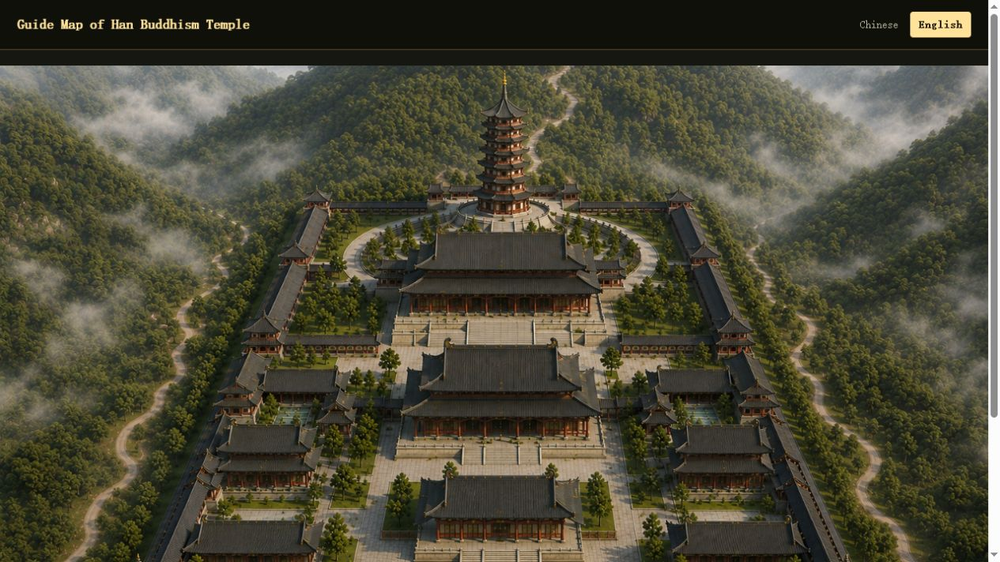

# Chinese Buddhist Xizhou Temple Guide (TempV02)

[中文](README.md) | **English**

A framework-free interactive guide to Xizhou Temple. Visitors can select hotspots on the aerial monastery map and open illustrated pages for the Bell Tower, Drum Tower, Mountain Gate, Hall of Heavenly Kings, Ksitigarbha Hall, Guanyin Hall, Mahavira Hall, Huayan Three Sages Hall, Western Three Sages Hall, Five Contemplations Hall, Patriarchs' Hall, Seven-Tier Stupa (Lamp-Lighting Pagoda), and the Chan forest path leading to the rear mountain. Content for many halls is still being designed and developed. The website provides Chinese and English versions, while the Bell Tower and Drum Tower also include interactive audio hotspots.

> **Version notice**  
> This repository contains the historical **V02** release for open-source reference, learning, and maintenance. The currently deployed website runs **V03** at [www.xizhoutemple.com](https://www.xizhoutemple.com).

> TempV02 is a preserved historical version of the Xizhou Temple Guide project. This repository contains its source code, bilingual content, media assets, and local development workflow.

## Features

- Accessible interactive hotspots over an aerial monastery map
- Dedicated pages for 16 monastery halls and locations
- Markdown-driven descriptions
- Chinese (`/zh/`) and English (`/en/`) entry points
- Image galleries, related-page links, and localized audio interaction
- Static English hall pages and a sitemap for indexing

## Preview



See the complete [English illustrated guide](docs/RUNNING_GUIDE.en.md), or open the [Chinese illustrated guide](docs/RUNNING_GUIDE.zh-CN.md).

## Quick start

Requirement: Node.js. The local server uses Node.js built-in modules only and has no third-party runtime dependencies.

```bash
git clone https://github.com/GarrySkandar/xizhoutemple-v02.git
cd xizhoutemple-v02
node server.js
```

Then open:

- Chinese: `http://localhost:3000/zh/`
- English: `http://localhost:3000/en/`

To use a different port in PowerShell:

```powershell
$env:PORT=8080; node server.js
```

## Project structure

```text
xizhoutemple-v02/
├── assets/                 # Shared map artwork
├── images/                 # Hall and location images
├── music/                  # Bell and drum audio
├── content/                # Chinese Markdown; English/ contains English sources
├── data.js                 # Hotspot positions and media relationships
├── index.html + main.js    # Source home page and hotspot rendering
├── halls/                  # Existing Chinese static hall pages
├── generate-pages.js       # Earlier/standalone Chinese page generator
├── build-locales.js        # Produces zh/ and EN/ locale copies
├── build-sites.js          # Produces the dist/ Sites deployment output
├── server.js               # Dependency-free local static server
├── zh/                     # Generated Chinese locale copy
└── EN/                     # Generated English locale copy
```

For the full data flow and build boundaries, see the [architecture guide](docs/ARCHITECTURE.md).

## Editing content

1. Edit Chinese descriptions in `content/<id>.md`.
2. Edit the matching English descriptions in `content/English/<id>.md`.
3. Add or adjust hotspot IDs, positions, images, and audio in `data.js`.
4. Read the build-safety section below before regenerating locale copies.

Each hotspot `id` must match its Markdown and detail-page filenames. For example, `shanmen` maps to `content/shanmen.md` and `halls/shanmen.html`.

## Build safety

`npm run build` runs `build-locales.js` followed by `build-sites.js`. These scripts delete and recreate:

- `zh/`
- `EN/`
- `dist/`

Do not keep hand-edited content only in those directories. Before building, inspect the Git status and commit or back up anything that must be preserved. Editable source content belongs in `content/`, `assets/`, `images/`, `music/`, and the root source files.

## Before reusing or redistributing

- Confirm that all text, images, and audio may be redistributed publicly, or add source and license information.
- Choose licenses appropriate for the code and for the content/media; they may require separate terms.
- Treat `zh/` and `EN/` as generated locale copies and keep one documented publishing strategy.

## License

This repository does not currently include a license. Add explicit licensing terms before treating the code, text, images, or audio as reusable open-source material.
