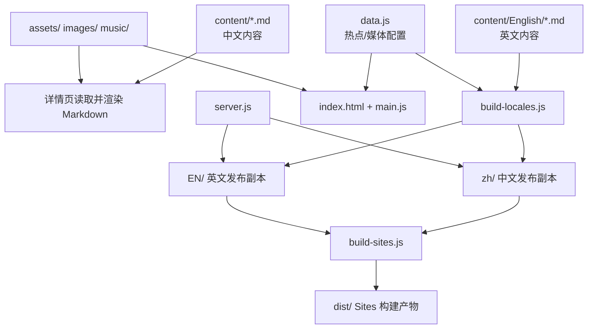

# TempV02 架构说明

## 1. 项目定位

TempV02 是一个零第三方运行时依赖的静态导览网站。它以一张寺院鸟瞰图作为入口：热点坐标和媒体关联保存在 JavaScript 数据文件中，殿堂介绍保存在 Markdown 中，页面在浏览器端请求 Markdown 后渲染为 HTML。

系统分为四层：内容与媒体、交互数据、静态页面、构建与本地服务。

## 2. 源码与生成物的边界

| 类别 | 目录/文件 | 责任 | 编辑建议 |
| --- | --- | --- | --- |
| 内容源 | `content/` | 中文介绍；`content/English/` 为英文介绍 | 直接编辑 |
| 结构化数据 | `data.js` | 热点名称、坐标、尺寸、图片、音效、关联页 | 直接编辑 |
| 共享媒体 | `assets/`、`images/`、`music/` | 鸟瞰图、殿堂图片、音频 | 直接编辑，先确认授权 |
| 中文源页面 | `index.html`、`main.js`、`styles.css`、`halls/` | 中文首页、交互、样式、现有详情页 | 直接编辑；注意与生成脚本的关系 |
| 语言构建脚本 | `build-locales.js` | 基于源内容重建 `zh/` 和 `EN/` | 修改前先理解删除/复制逻辑 |
| 部署构建脚本 | `build-sites.js` | 复制发布文件、转 WebP、产出 worker | 修改前先在临时目录验证 |
| 本地服务 | `server.js` | 将 `/` 映射至 `/zh/`，将 `/en/` 映射至 `EN/` | 一般无需修改 |
| 生成物 | `zh/`、`EN/`、`dist/` | 本地化发布副本与部署产物 | 不应作为唯一内容源 |

## 3. 首页与热点交互

1. 首页加载 `data.js`，该文件声明全局 `HALLS` 数组。
2. `main.js` 遍历 `HALLS`，根据 `x`、`y`、`w`、`h` 生成绝对定位链接。
3. 链接指向 `halls/<id>.html`；`aria-label` 使用地点名称。
4. 浏览器在图片上叠加热点，用户点击后进入详情页。

`HALLS` 中的主要字段：

| 字段 | 用途 |
| --- | --- |
| `id` | 稳定标识；与 Markdown、详情页文件名对应 |
| `name` | 热点的显示名称与无障碍标签 |
| `x`、`y`、`w`、`h` | 相对鸟瞰图的百分比位置与大小 |
| `image` / `images` | 单张或多张详情图片 |
| `imageLink` | 图片卡片要跳转的关联详情页（可选） |
| `sound`、`soundLabel`、`soundHotspot` | 音频文件及其可点击区域（可选） |

目前 `data.js` 还包含位置、供奉、功能、象征意义、摘要和介绍等文本字段；当前页面主要以 Markdown 为准，因此这些字段属于可供后续扩展或迁移的冗余内容数据。更新同一事实时应避免两处不一致。

## 4. 详情页与 Markdown

每个详情页内嵌一个轻量 Markdown 渲染器，支持：

- 1 到 3 级标题
- 段落
- 有序列表
- 粗体与斜体

页面使用 `fetch()` 加载对应 Markdown，并每两秒检查一次内容变化，方便本地编辑时刷新内容。该机制要求经 HTTP 服务访问；直接双击打开 HTML 文件时，浏览器通常会阻止 Markdown 请求。

中文详情页位于 `halls/`，英文详情页由 `build-locales.js` 写入 `EN/halls/`。英文生成页包含标题、摘要、canonical、图片卡片和可选音频交互。

## 5. 语言与路由

本地服务的路由约定如下：

| 请求路径 | 服务文件 |
| --- | --- |
| `/` 或 `/zh/` | `zh/` |
| `/en/` | `EN/` |
| 其他静态路径 | TempV02 根目录下的同名资源 |

`build-locales.js` 以根目录的中文资源为输入：

- 重建 `zh/`，复制中文页面、内容、图片和音频；
- 重建 `EN/`，复制共享媒体、读取 `content/English/`，并生成英文首页、热点数据及 16 个英文详情页；
- 重写根 `index.html`，使其跳转到 `zh/`。

注意：当前仓库同时保留根级 `halls/`、`zh/halls/` 和 `EN/halls/`。这是一种可运行但存在重复的发布布局；若准备长期维护，建议在单独变更中确定唯一的源页面与生成策略。

## 6. Sites 发布构建

`build-sites.js` 的职责是创建 `dist/`：

1. 清空并新建 `dist/` 与 `dist/assets/`。
2. 将根目录中的大部分文件复制进 `dist/assets/`，并把 `EN` 重命名为 `en`。
3. 移除语言副本中重复的 `assets/`、`images/`、`music/`，以共享媒体资源。
4. 使用系统中的 `ffmpeg` 将 PNG 转为 WebP，并更新文本文件中的 `.png` 引用。
5. 写入一个 worker，使带语言前缀的媒体请求回落到共享资源。

该步骤需要系统已安装并可调用 `ffmpeg`。它会销毁既有 `dist/`，因此属于发布生成，不应在未备份的手工编辑目录上运行。

## 7. 本地开发流程

推荐的安全流程：

1. 修改源 Markdown、`data.js` 或共享媒体。
2. 使用 `node server.js` 检查现有语言副本中的页面表现。
3. 如果需要把源改动同步到 `zh/` 与 `EN/`，先检查 `git status` 与目标目录差异，提交或备份需要保留的内容。
4. 再运行 `npm run build`。
5. 重新打开 `/zh/` 和 `/en/` 做人工验收，确认图片、Markdown、音效和语言切换均正常。

## 8. GitHub 开源建议

### 推荐仓库策略

- 把 `content/`、`data.js`、根级页面、共享媒体和构建脚本视为源文件。
- 明确是否提交 `zh/`、`EN/`、`dist/`。若提交，应在 README 中标为生成物；若不提交，需要完善构建步骤以确保可复现。
- 将大体积图片/音频纳入授权审查；如文件体积持续增大，可评估 Git LFS。
- 在根目录或 TempV02 目录新增 `LICENSE`、`CONTRIBUTING.md`、`CODE_OF_CONDUCT.md` 和 Issue/PR 模板（这些文件需要由项目维护者确认具体许可和社区规则）。

### 发布前风险检查

1. 版权：图片、音频、文稿、字体与第三方素材是否可公开再发布。
2. 隐私与部署：检查 `.openai/hosting.json` 以及所有配置中是否包含不应公开的项目标识或环境信息。
3. 生成一致性：从干净的工作副本运行构建，确认没有遗漏的文件和不可复现差异。
4. 编码：用 UTF-8 无 BOM 保存中文内容；在命令行中如出现乱码，优先检查终端代码页，不要直接以乱码内容回写源文件。
5. 许可证：代码许可与内容/媒体许可可能不同，需分别声明。

## 9. 当前可改善项（不在本文档变更范围内）

- 构建脚本当前直接删除 `zh/`、`EN/` 和 `dist/`；可改成输出至临时目录、逐文件比较后合并。
- `package.json` 标记为 `private: true`，正式独立开源包发布前应由维护者决定是否保留。
- `generate-pages.js` 与 `build-locales.js` 存在功能重叠，应确认是否保留前者。
- `data.js` 和 Markdown 均存有部分介绍文本，建议指定一个唯一事实来源。
- 本地路由使用 `EN/` 目录而 URL 使用小写 `/en/`，部署到大小写敏感的环境前应做一次完整验收。
