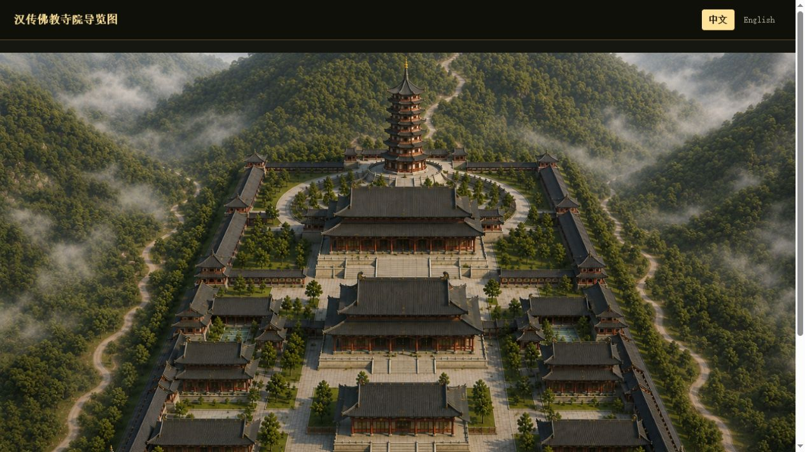
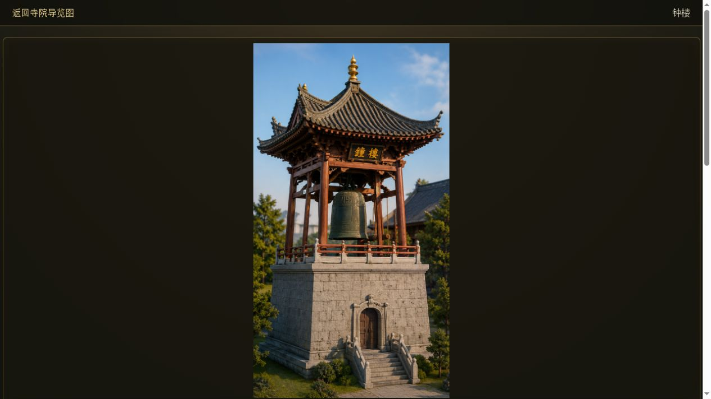

# TempV02 运行效果与使用说明

TempV02 是一个以寺院鸟瞰图为入口的互动导览网站。访问者选择中文或 English 后，可点击图中任一殿堂进入图文详情；部分建筑还提供现场音效互动。

[English guide](RUNNING_GUIDE.en.md)

## 1. 打开首页

本地运行后，访问中文入口 `http://localhost:3000/zh/`。页面会显示寺院全景和可点击的建筑热点。



在导览图上移动或点击热点，可进入山门、天王殿、大雄宝殿、钟楼等地点的介绍页。热点同时带有可访问标签，键盘用户也可通过 Tab 键定位并打开。

## 2. 切换中文与英文

首页右上角为语言切换入口：

| 当前页面 | 可切换至 | 部署后的地址 |
| --- | --- | --- |
| 中文首页 | English | `/en/` |
| English home | 中文 | `/zh/` |

切换语言时会打开同一导览地图的对应语言版本。两种语言共用图片和音频资源，但各自使用本地化的热点名称、详情标题和 Markdown 内容。

> 部署建议：请将站点部署在域名根路径，例如 `https://example.org/zh/` 和 `https://example.org/en/`。当前语言入口使用根路径；若部署到 GitHub Pages 的项目子路径（如 `https://name.github.io/repo/`），需先调整语言链接或配置自定义域名。

## 3. 阅读建筑详情与播放音效

点击热点后会进入独立详情页。页面包含返回导览图的入口、建筑图片、Markdown 图文介绍及原文链接。



以钟楼、鼓楼为例，图片上的透明热点可播放对应钟声或鼓声；这些热点支持鼠标点击、Enter 和空格键触发。Markdown 内容通过本地 HTTP 服务读取，因此请使用 `node server.js` 访问页面，而不要直接双击 HTML 文件。

## 4. 英文导览效果

访问 `http://localhost:3000/en/` 可打开英文版。英文首页保留相同的空间导览和媒体体验，并将建筑名称、详情标题和内容替换为英文。


英文详情页使用静态、可索引的 `halls/<id>.html` 地址；中文和英文页面都可通过顶部导航返回导览图。

## 5. 面向部署的验收清单

在发布预览环境中，请至少验证以下项目：

1. 打开 `/zh/`，检查中文首页、热点和详情页是否正常。
2. 点击右上角 `English`，确认打开 `/en/`。
3. 在 `/en/` 点击 `Chinese`，确认能回到 `/zh/`。
4. 打开一个中英文详情页，检查 Markdown、图片和返回导航。
5. 分别测试钟楼与鼓楼的音效热点。
6. 在手机宽度下检查顶部语言切换和导览图是否仍可使用。

## 本地启动

```bash
git clone https://github.com/GarrySkandar/xizhoutemple-v02.git
cd xizhoutemple-v02
node server.js
```

默认地址：中文 `http://localhost:3000/zh/`，英文 `http://localhost:3000/en/`。

构建发布副本前，请先阅读 [架构说明](ARCHITECTURE.md) 中的“构建安全”说明：现有构建脚本会重建 `zh/`、`EN/` 和 `dist/`。
